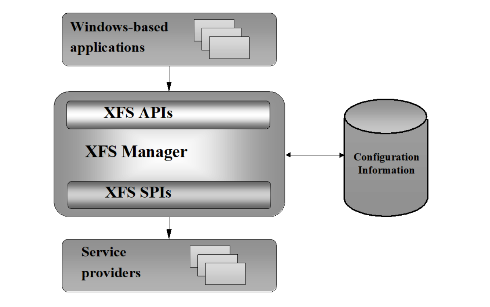

# XFS 的架构

以上是 XFS 的架构图，总的来说，ATM 应用（Windows-base applications）和 SP (Service Provider) 是开发商需要遵循 XFS 标准进行开发的。ATM 应用如果要控制各个硬件，就需要在遵循 XFS 的标准下进行开发。

需要注意的是，XFS 只是定义了一个标准，并没有明确的实现，各个公司一般都有自己的基于 XFS 的实现，比如大名鼎鼎的 XDC/DDC 协议，就是遵循了 XFS 规范。如果你也要进入 ATM 领域的开发，除了要学习 XFS 标准，还需要学习其对应的实现。

下面咱们来认识一下其中的各个组件。

## Windows-based applications
该应用是运行在 ATM 机上的应用，负责跟用户进行交互。

## XFS APIs & XFS Manager & XFS SPIs
1. XFS 定义的核心接口规范，ATM 应用接收到用户的操作后，调用 XFS API
2. XFS Manager 把 XFS API 的请求路由转发到 XFS SPI
3. XFS Manager 还会把请求路由转发到对应的 SP(Service Provider)

## SP(Service Provider)
SP是对外开放的一个扩展点，ATM 应用的开发商和硬件提供商需要遵循 XFS 的标准实现 SP，一类硬件通常需要对应一个 SP 实现。比如：CDM 存款机有 CDM 的 SP，凭条打印机有凭条打印机的 SP，银行卡识别机有银行卡的 SP。各自独立，互不影响。

XFS 标准没有约束 SP 与服务的通讯，SP 与服务的通讯是供应商的内部设计问题，XFS 并不关心。

SP 的主要功能如下：
* 将通用（例如基于表单的）服务请求转换为特定服务的命令。
* 将请求路由到本地服务或设备，或者路由到远程系统上的服务或设备，有效地在服务提供商之间定义一个对等接口。
* 对多个应用程序对单个服务或设备的访问进行仲裁，在请求时提供独占访问。
* 管理服务或设备的硬件接口。
* 以适当的方式管理服务和设备的异步特性，并始终通过 Windows 消息将此功能呈现给 XFS 管理器和应用程序。