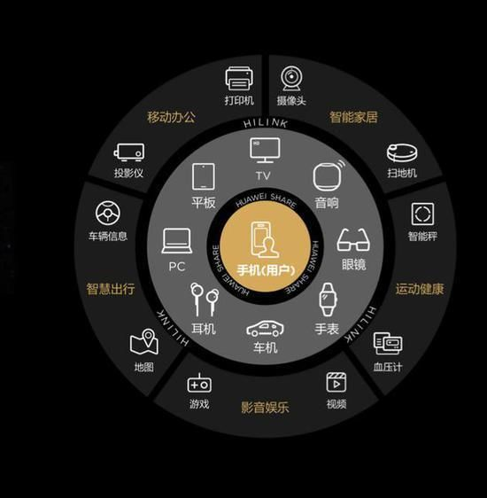

# 常见问题

## 1. 什么是1+8+N？

“1+8+N” 是华为HarmonyOS打造的全场景战略。其中：

* 1 - 指智能手机
* 8 - 指8大行星，包括大屏、音箱、眼镜、手表、车机、耳机、平板、PC
* N - 代表着万物，即无限可能的泛 IoT 设备，包含移动办公、智能家居、运动健康、影音娱乐及智能出行各大板块的延伸业务

## 2. 什么是 HarmonyOS HiLink & HarmonyOS Connect

HUAWEI HiLink，是华为开发的智能家居开放互联平台，目的解决各智能终端之间互联互动问题。平台功能主要包含智能连接、智能联动两部分。2021年5月18日，华为宣布华为HiLink将与HarmonyOS统一为HarmonyOS Connect。

HarmonyOS Connect
HarmonyOS Connect是华为全新推出的智能硬件生态品牌，将原“Work With HUAWEI HiLink”和“Powered by HarmonyOS”品牌进行融合，统一消费者和伙伴的品牌认知。

这意味着，你的设备即便不是HarmonyOS系统，仍然可以使用HarmonyOS Connect方式来与HarmonyOS系统互联。
