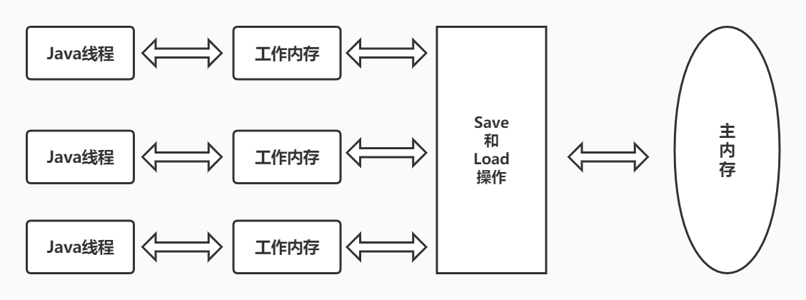

# Java内存模型（Java Memory Model）

## 重新认识缓存
在开始这个话题之前，先了解一下缓存的概念。

我们都知道：CPU、内存、磁盘三者的处理速度也是不对等的。拿CPU跟内存来说，如果CPU每次处理都需要实时从内存读取数据，那CPU有很长时间都会等着。为了减少跟内存的交互次数，提升处理速度，CPU引入了高速缓存。这也就是我们常说的 L1 Cache、L2 Cache、L3 Cache。

总结：`CPU高速缓存是用于解决CPU、内存处理速度不匹配问题；内存缓存是用于解决内存、磁盘处理速度不匹配问题。`

然而，高速缓存的引入却带来了新的问题 —— 缓存一致性问题。

**缓存一致性问题**  
假设有一个多线程的程序，同时对一个变量进行累加操作（i++）。两个线程同时复制了内存中的值到高速缓存中，进行累操作，操作完了之后再将结果写回内存。在进行累加操作前，由于两个线程读取到了同一个值，问题就出现了。

CPU为了解决高速缓存、内存不一致性问题，制定了一个缓存一致协议（[MESI协议](https://zh.wikipedia.org/wiki/MESI%E5%8D%8F%E8%AE%AE)）。CPU高速缓存、内存之间的数据进行交换时，就需要遵循这个协议中的规范。

我们的程序运行在操作系统中，操作系统负责跟底层的硬件交互，那操作系统就需要解决这个缓存一致性的问题。于是操作系统通过**内存模型**制定了一系列规范来解决这个问题。windows、linux都有各自的内存模型。

## 指令重排序
我们按串行的方式写的代码，但是操作系统在执行时不一定会按照我们写的顺序来执行，因为操作系统为了提升执行速度和性能，会对指令进行重排序。

一份Java代码会经过3次重排序：`编译器优化重排 -> 指令并行重排 -> 内存系统重排`。

指令重排序可以保证串行语义一致，但是并没有提供给多线程语义一致。所以在多线程的时候，指令重排序也会引起并发问题。

## JMM
JMM全称是Java Memory Model，是Java定义语言的内存模型，遵循[JSR-133规范](http://www.cs.umd.edu/~pugh/java/memoryModel/CommunityReview.pdf)。Java是跨平台的，其在底层屏蔽了操作系统的差异，简化了程序的开发。

也因为如此，我们在上层开发的时候，不用关系跟底层操作系统的交互，直接使用Java提供的关键字、类（比如volatile，sychronized、lock）就可以开发出线程安全的程序了。

简单的说，JMM规定了Java中共享变量的访问规则。

> 注意：这里的共享变量指的是实例字段，静态字段等在多线程时不安全的字段；像局部变量或者方法的参数，是线程私有的，不存在线程安全问题。

根据上图，两个线程如果要进行通信的话，必须要经历下面 2 个步骤：
* 线程 1 把本地内存中修改过的共享变量副本的值同步到主内存中去。
* 线程 2 到主存中读取对应的共享变量的值。
也就是说，JMM 为共享变量提供了可见性的保障。

但是多线程的时候，对主内存中的一个共享变量进行操作仍有可能出现线程安全问题。比如：
* 线程 1 和线程 2 分别对同一个共享变量进行操作，一个执行修改，一个执行读取。
* 线程 2 读取到的是线程 1 修改之前的值还是修改后的值并不确定，都有可能，因为线程 1 和线程 2 都是先将共享变量从主内存拷贝到对应线程的工作内存中。

### 主内存和工作内存
JMM规定：
1. 所有变量都存储在主内存中。
2. 每个线程有自己的工作内存（保存了使用的变量的主内存的副本），所有操作都必须在工作内存中进行。
3. 那么不同的线程之间如果需要共享变量的值，就都需要通过主内存来完成。

> 注意：的主内存和工作内存于Java的内存区域中的堆、栈、元数据区等并无任何关系，属于不同层次的视角。如果一定要对应起来的化，那么根据变量、主内存和工作内存的定义来看：
1. 主内存对应的是堆中的Java的对象的实例数据。物理中的内存。
2. 工作内存对应着Java线程栈中的局部变量表等部分区域的数据。为了提升速度，工作内存可能存储在CPU的高速缓存中或者寄存器中。

### Happens-Before
Happens-Before是用来描述Java内存模型中两个操作之间的顺序关系，如果操作A的结果对操作B可见，那我们就说A happens before B。

其定义了很多规则，常见的有下面这么几个：
1. 程序顺序：单线程中，每个操作都before于后续的操作。
2. 监视器锁：每一个监视器的解锁，before于后面的加锁。
3. volatile关键字: 对一个volatile的写，before后续任意的读。
4. 传递性: A before B, B before C，那么A before C。

# volatile
volatile可以看做是轻量的synchronized，执行成本低，不会引发线程的上下文切换。如果一个变量用了volatile修饰，意味着所有线程看到变量的值是一样的。

volatile有以下两个特征：
1. 保证了多线程操作共享变量的可见性
2. 禁止了指令重排序

但是不保证原子性

其原理如下：
1. 写操作强制同步到主内存。
2. 写操作强制失效其他线程的工作内存中的变量值。

# 参考
1. [Java语言规范 —— 内存模型](https://docs.oracle.com/javase/specs/jls/se8/html/jls-17.html#jls-17.4)
2. [JMM（Java 内存模型）详解](https://javaguide.cn/java/concurrent/jmm.html)
3. [Java Memory Model](https://linianhui.github.io/java/jmm/)