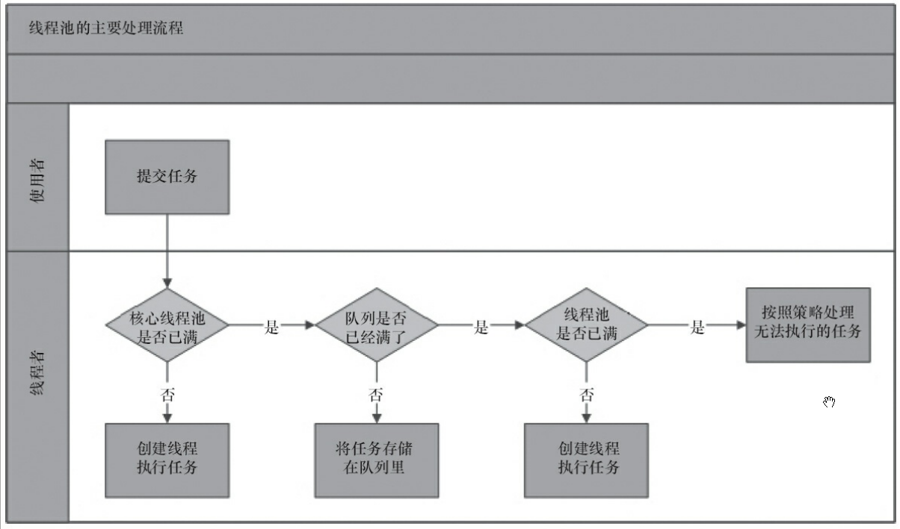

# 线程池 —— ThreadPoolExecutor
在学习线程池之前，在代码中创建线程来处理任务，通常是直接使用 Thread 类。但是线程是稀缺资源，在业务繁忙的时候用 Thread 类可能出现无限制的创建，不仅会消耗系统资源，还会降低系统的稳定性，而且无法统一分配和监控。由此，线程池的使用是每个研发必须掌握的一门技能，使用线程池有如下好处：
  * **降低资源消耗**：可以重复利用线程池中的编程，避免创建、销毁的重复工作
  * **提高响应速度**：任务到达时，直接从线程池获取线程执行，避免重新开始创建
  * **便于监控和管理**：线程是稀缺资源，不能无限制创建，使用线程池可以进行统一的分配，调优和监控

## ThreadPoolExecutor的核心参数
  * **corePoolSize**: 核心线程数线程数定义了最小可以同时运行的线程数量。
  * **maximumPoolSize**: 当队列中存放的任务达到队列容量的时候，当前可以同时运行的线程数量变为最大线程数。
  * **workQueue**: 当新任务来的时候会先判断当前运行的线程数量是否达到核心线程数，如果达到的话，新任务就会被存放在队列中。
  * **keepAliveTime**: 当线程池中的线程数量大于 corePoolSize 的时候，如果这时没有新的任务提交，核心线程外的线程不会立即销毁，而是会等待，直到等待的时间超过了 keepAliveTime才会被回收销毁；
  * **unit**: keepAliveTime 参数的时间单位。
  * **threadFactory**:executor 创建新线程的时候会用到。
  * **handler**: 饱和策略。关于饱和策略下面单独介绍一下。

下面这张图可以加深对参数的理解:


## ThreadPoolExecutor的工作原理
核心逻辑在 execute 方法中：
```java
   // 存放线程池的运行状态 (runState) 和线程池内有效线程的数量 (workerCount)
   private final AtomicInteger ctl = new AtomicInteger(ctlOf(RUNNING, 0));

    private static int workerCountOf(int c) {
        return c & CAPACITY;
    }
    //任务队列
    private final BlockingQueue<Runnable> workQueue;

    public void execute(Runnable command) {
        // 如果任务为null，则抛出异常。
        if (command == null)
            throw new NullPointerException();
        // ctl 中保存的线程池当前的一些状态信息
        int c = ctl.get();

        //  下面会涉及到 3 步 操作
        // 1.首先判断当前线程池中执行的任务数量是否小于 corePoolSize
        // 如果小于的话，通过addWorker(command, true)新建一个线程，并将任务(command)添加到该线程中；然后，启动该线程从而执行任务。
        if (workerCountOf(c) < corePoolSize) {
            if (addWorker(command, true))
                return;
            c = ctl.get();
        }
        // 2.如果当前执行的任务数量大于等于 corePoolSize 的时候就会走到这里
        // 通过 isRunning 方法判断线程池状态，线程池处于 RUNNING 状态并且队列可以加入任务，该任务才会被加入进去
        if (isRunning(c) && workQueue.offer(command)) {
            int recheck = ctl.get();
            // 再次获取线程池状态，如果线程池状态不是 RUNNING 状态就需要从任务队列中移除任务，并尝试判断线程是否全部执行完毕。同时执行拒绝策略。
            if (!isRunning(recheck) && remove(command))
                reject(command);
                // 如果当前线程池为空就新创建一个线程并执行。
            else if (workerCountOf(recheck) == 0)
                addWorker(null, false);
        }
        //3. 通过addWorker(command, false)新建一个线程，并将任务(command)添加到该线程中；然后，启动该线程从而执行任务。
        //如果addWorker(command, false)执行失败，则通过reject()执行相应的拒绝策略的内容。
        else if (!addWorker(command, false))
            reject(command);
    }

```

用流程图来表示一下，就是下图：


## 几种常见的线程池
在 java.util.concurrent 包下有一个 Executors 工具类，该工具类中包含了几种便利地创建线程池的方式，**使用时需要了解其各个参数和原理，否则使用不当会造成风险**，究其本质还是对 ThreadPoolExecutor 的封装和使用。

### FixedThreadPool
先来看看 FixedThreadPool 的实现：
```java
    public static ExecutorService newFixedThreadPool(int nThreads) {
        return new ThreadPoolExecutor(nThreads, nThreads,
                                      0L, TimeUnit.MILLISECONDS,
                                      new LinkedBlockingQueue<Runnable>());

    // 重载方法，多了一个 threadFactory 参数，可用于规范线程名称
    public static ExecutorService newFixedThreadPool(int nThreads, ThreadFactory threadFactory) {
        return new ThreadPoolExecutor(nThreads, nThreads,
                                      0L, TimeUnit.MILLISECONDS,
                                      new LinkedBlockingQueue<Runnable>(),
                                      threadFactory);
```

FixedThreadPool 用于创建一个可重用的固定线程数的线程池，但是因为工作队列使用了无界队列 LinkedBlockingQueue(容量为 Integer.MAX_VALUE)，会产生如下影响：
  * maxPoolSize 参数无效，因为队列不会满，这点根据线程池的工作流程可以知道。corePoolSize 跟 maxPoolSize 设置成了同一个值
  * keepAliveTime 参数无效
  * 任务很多的时候，会造成OOM

### SingleThreadExecutor
先来看看 SingleThreadExecutor 的实现：
```java
    public static ExecutorService newSingleThreadExecutor() {
        return new FinalizableDelegatedExecutorService
            (new ThreadPoolExecutor(1, 1,
                                    0L, TimeUnit.MILLISECONDS,
                                    new LinkedBlockingQueue<Runnable>()));
    }

    // 重载方法，多了一个 threadFactory 参数，可用于规范线程名称
    public static ExecutorService newSingleThreadExecutor(ThreadFactory threadFactory) {
        return new FinalizableDelegatedExecutorService
            (new ThreadPoolExecutor(1, 1,
                                    0L, TimeUnit.MILLISECONDS,
                                    new LinkedBlockingQueue<Runnable>(),
                                    threadFactory));
    }
```
SingleThreadExecutor 可以就是 FixedThreadPool 的翻版，只是需要设置线程个数为1。也因此， FixedThreadPool 该有的问题一个都不会少。采用了无界队列，任务堆积过多时，最终会引发OOM。


### CachedThreadPool
先来看看 CachedThreadPool 的实现：
```java
    public static ExecutorService newCachedThreadPool() {
        return new ThreadPoolExecutor(0, Integer.MAX_VALUE,
                                      60L, TimeUnit.SECONDS,
                                      new SynchronousQueue<Runnable>());
    }

    // 重载方法，多了一个 threadFactory 参数，可用于规范线程名称
    public static ExecutorService newCachedThreadPool(ThreadFactory threadFactory) {
        return new ThreadPoolExecutor(0, Integer.MAX_VALUE,
                                      60L, TimeUnit.SECONDS,
                                      new SynchronousQueue<Runnable>(),
                                      threadFactory);
    }
```
CachedThreadPool 会根据需要来创建新的线程，corePoolSize 为0，maxPoolSize 为 Integer.MAX_VALUE（无界），队列采用了 SynchronousQueue，不会存储任何任务。所以，如果任务的提交速度大于 maxPoolSize 中线程处理的速度，会不断创建新的线程，极端情况下会耗尽CPU和内存资源。

CachedThreadPool 允许创建的线程数量为 Integer.MAX_VALUE ，可能会创建大量线程，从而导致 OOM。

### ScheduledThreadPoolExecutor
ScheduledThreadPoolExecutor 主要用来在给定的延迟后运行任务，或者定期执行任务。

## 拒绝策略
如果所有的线程数都在工作，而且任务队列也已经满了的时候，ThreadPoolTaskExecutor 定义了4种策略用来处理这类情况：

* **ThreadPoolExecutor.AbortPolicy**：抛出 RejectedExecutionException来拒绝新任务的处理。注意需要在finally中关闭线程池，否则如果抛出异常时，会导致内存泄露。
* **ThreadPoolExecutor.CallerRunsPolicy**：调用执行自己的线程运行任务，也就是直接在调用execute方法的线程中运行(run)被拒绝的任务，如果执行程序已关闭，则会丢弃该任务。因此这种策略会降低对于新任务提交速度，影响程序的整体性能。如果您的应用程序可以承受此延迟并且你要求任何一个任务请求都要被执行的话，你可以选择这个策略。**该方法会阻塞执行程序的运行，直到线程都执行完毕**
* **ThreadPoolExecutor.DiscardPolicy**：直接丢弃任务，不会给出任何提示
* **ThreadPoolExecutor.DiscardOldestPolicy**：直接丢弃最早的未处理的任务，不会给出任何提示

上面的4种拒绝策略有时也不能满足业务需求，这时就需要自定义拒绝策略，方法也简单，继承`RejectedExecutionHandler`，实现`rejectedExecution`即可。

## 关闭线程池
线程池使用完毕后一般是需要关闭的，否则就会造成内存泄露。ExecutorService 提供了 `shutdown` 和 `shutdownNow` 两个方法用来关闭线程池，二者有很大的不同，我们可以根据具体的业务场景来进行选择。

  * **shutdown**: 不再接收新的任务，但是已经提交的任务会继续执行。
  * **shutdownNow**: 不再接收新的任务，但是会调用 interrupt 方法来尝试中断正在执行的任务。如果你的任务没有对 interrupt 进行响应，则该方法就跟 shutdown 一样。

### shutdown

### shutdownNow

## 合理地配置线程池
线程池参数那么多，要怎么设置才能既不浪费系统资源，又能提高效率呢？

这里主要讲一下线程池大小的设置，有一个简单而有效的方法：你的线程池要处理的任务是 CPU 密集任务还是 IO 密集任务？
  * CPU 密集型任务(N+1)： 这种任务消耗的主要是 CPU 资源，可以将线程数设置为 N（CPU 核心数）+1，比 CPU 核心数多出来的一个线程是为了防止线程偶发的缺页中断，或者其它原因导致的任务暂停而带来的影响。一旦任务暂停，CPU 就会处于空闲状态，而在这种情况下多出来的一个线程就可以充分利用 CPU 的空闲时间。
  * I/O 密集型任务(2N)： 这种任务应用起来，系统会用大部分的时间来处理 I/O 交互，而线程在处理 I/O 的时间段内不会占用 CPU 来处理，这时就可以将 CPU 交出给其它线程使用。因此在 I/O 密集型任务的应用中，我们可以多配置一些线程，具体的计算方法是 2N。

## 监控线程池
先来看看这几个场景：
  1. 如何知道线程池参数设置得是否合理，并对其进行调优
  2. 线程池是否有阻塞

如果系统中使用了大量的线程池，那么对其进行监控就能在问题出现时，可以根据线程池的使用状况快速定位问题。甚至可以做到未卜先知，而不是亡羊补牢。

## FAQ
### 1. 线程池能容纳多少个线程？
TODO...

# 参考
1. 书籍：Java并发编程的艺术，方腾飞 魏鹏 程晓明 著，机械工业出版社
2. [硬核干货：4W字从源码上分析JUC线程池ThreadPoolExecutor的实现原理](https://www.throwx.cn/2020/08/23/java-concurrency-thread-pool-executor/)
3. [Java线程池详解](https://javaguide.cn/java/concurrent/java-thread-pool-summary.html#%E4%B8%80-%E4%BD%BF%E7%94%A8%E7%BA%BF%E7%A8%8B%E6%B1%A0%E7%9A%84%E5%A5%BD%E5%A4%84)