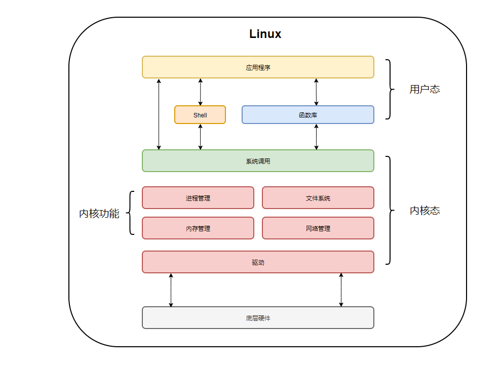

# Linux下的5种IO模型
Linux下的IO主要分为：阻塞IO、非阻塞IO、同步IO、异步IO。

同步：调用方轮询去查询被调用方，看是否处理完成，在这期间调用方会一直等待服务端响应，直到返回结果。
异步：被调用方完成处理后，通过回调的方式主动通知调用方。
阻塞: 调用方发起调用后，会发生阻塞，直到被调用方返回结果，调用方才能继续后面的操作。
非阻塞: 调用方发起调用后，被调用方会立即返回状态（不包含数据），调用方不会被挂起，可以继续后面的操作。
阻塞和非阻塞解决了应用层等待数据返回时的状态问题，同步还是异步，关注的是任务完成时消息通知的方式。由调用方盲目主动问询的方式是同步调用，由被调用方主动通知调用方任务已完成的方式是异步调用。

同步异步的区别在于：服务端在拷贝数据时是否阻塞调用端线程；阻塞和非阻塞的区别在于：调用端线程在调用 function 后是否立刻返回。

## 用户态与内核态
先从概念上理解一下用户态与内核态。

内核态：Linux为了保障系统资源的安全性，将对系统资源，如磁盘、网络IO、内存等硬件的操作进行的封装，且限定只有在操作系统的内核中才能访问这些资源，在内核中执行指令时就处于内核态。
用户态：一个进程在执行的时候，运行在用户地址空间中，这时就处于用户态。

当进程运行在内核空间时就处于内核态，而进程运行在用户空间时则处于用户态。用户态、内核态之间是可以互相切换的。

为什么要设计的这么复杂呢？
  * 减少开发的复杂度，如果我们写的程序要访问硬件资源时，要自己去写读取硬盘的代码、读内存的代码，这无疑是及其复杂的。
  * 安全性，在有些CPU指令中，有些是非常危险的，会直接导致系统崩溃，试想一下，如果你写的代码有个bug，直接导致系统崩溃重启了，你的老板会是什么反应？

有了上述基础后，咱们再来看一下一个查询数据的请求，通常我们这样去理解：从磁盘中读取数据，然后加载到内存中，最后再将数据返回。其实内部经历了如下更为复杂的过程。
  * 用户进程发起一个系统调用
  * 内核执行指令，将数据从 [磁盘] 拷贝到 [内核buffer]
  * 将数据从 [内核buffer] 拷贝到 [用户buffer]
  * 数据拷贝完成后，返回数据

最后我们从内核空间和用户空间的角度看一看整个 Linux 系统的结构。它大体可以分为三个部分，从下往上依次为：硬件 -> 内核空间 -> 用户空间。

 * 系统调用：为了使应用程序访问到内核的资源，如 CPU、内存、I/O，内核必须提供一组通用的访问接口，这些接口就叫系统调用。
 * 库函数：屏蔽这些复杂的底层实现细节，减轻程序员的负担，从而更加关注上层的逻辑实现，它对系统调用进行封装，提供简单的基本接口给程序员。
 * shell：顾名思义，就是外壳的意思，就好像把内核包裹起来的外壳，它是一种特殊的应用程序，俗称命令行。Shell 也是可编程的，它有标准的 Shell 语法，符合其语法的文本叫 Shell 脚本，很多人都会用 Shell 脚本实现一些常用的功能，可以提高工作效率。

## 用户态与内核态的切换
有三种情况会导致从用户态切换到内核态：
  * 系统调用：用户态进程主动切换到内核态的方式，用户态进程通过系统调用向操作系统申请资源完成工作，例如 fork（）就是一个创建新进程的系统调用，系统调用的机制核心使用了操作系统为用户特别开放的一个中断来实现，如 Linux 的 int 80h 中断，也可以称为软中断
  * 异常：当 C P U 在执行用户态的进程时，发生了一些没有预知的异常，这时当前运行进程会切换到处理此异常的内核相关进程中，也就是切换到了内核态，如缺页异常
  * 中断：当 C P U 在执行用户态的进程时，外围设备完成用户请求的操作后，会向 C P U 发出相应的中断信号，这时 C P U 会暂停执行下一条即将要执行的指令，转到与中断信号对应的处理程序去执行，也就是切换到了内核态。如硬盘读写操作完成，系统会切换到硬盘读写的中断处理程序中执行后边的操作等。

## 5种IO模型
### 阻塞IO

### 非阻塞IO

### IO复用

### 信号驱动IO

### 异步IO

## 参考
1. [理解用户态和内核态](https://xie.infoq.cn/article/25df22c38dc0e925879ce4e9b)
2. [Linux的5种IO模型](https://xie.infoq.cn/article/df9d5150f408e600e4dedcadb)
3. [Linux的IO模型](https://www.cnblogs.com/supportmyself/p/14978168.html)