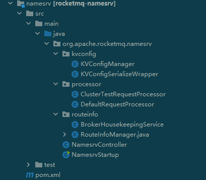

# RocketMQ
引用 [RocketMQ 官网](https://rocketmq.apache.org/docs/)的一段话:
> 根据我们的研究，随着队列和虚拟主题使用的增加，ActiveMQ IO模块达到了一个瓶颈。我们尽力通过节流、断路器或降级来解决这个问题，但效果并不理想。于是我们尝试了流行的消息传递解决方案
> Kafka。不幸的是，Kafka不能满足我们的要求，其尤其表现在低延迟和高可靠性方面，详见这里。在这种情况下，我们决定发明一个新的消息传递引擎来处理更广泛的消息用例，
> 覆盖从传统的pub/sub场景到高容量的实时零误差的交易系统。

> Apache RocketMQ 自诞生以来，因其架构简单、业务功能丰富、具备极强可扩展性等特点被众多企业开发者以及云厂商广泛采用。历经十余年的大规模场景打磨，RocketMQ 已经成为业内共识的金融级可
> 靠业务消息首选方案，被广泛应用于互联网、大数据、移动互联网、物联网等领域的业务场景。

## 四大组件
### 生产者 Producer

### 消费者 Consumer

### 名字服务器 NameServer
集群的协调者，Topic 的路由注册中心，支持 Topic、Broker 的动态注册与发现。

NameServer 是无状态的，每个实例保存着一份完整的路由信息，且各个实例相互之间不会通信，可以方便地作集群部署。

由于是无状态，为了保存和维护集群的元数据，不需要分布式锁了。再加上读取操作多，更改操作少特点，选择读写锁能大大提高效率。

所有的元数据保存在 **RouteInfoManager** 类中，打开就能看见读写锁的大量使用。

NameServer 很轻量，实现简单，代码量极少。底层通信依旧是采用了 Netty。

### 代理服务器 Broker

## 常见问题
### 集群模式下，RocketMQ在推送消息给消费者时，是如何做负载均衡的？

### 什么是顺序消费？在顺序消费模式下，RocketMQ是如何保证顺序消费的？

### 消息堆积（积压）应该如何解决？

## 项目实践
在处理企微回调时，将接收到的消息转发到消息队列，防止瞬间的流量过大而引发系统崩溃
