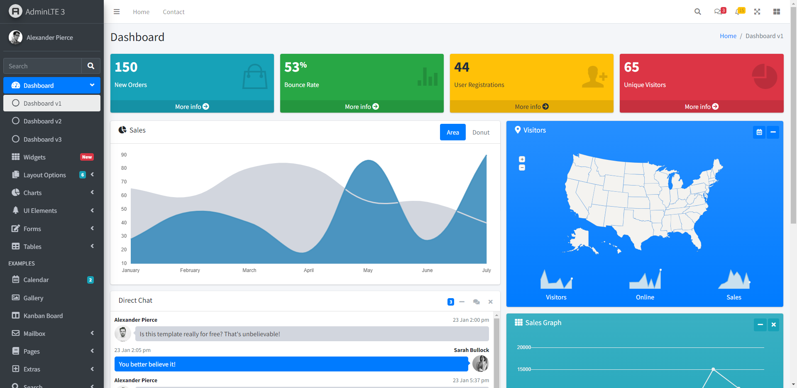
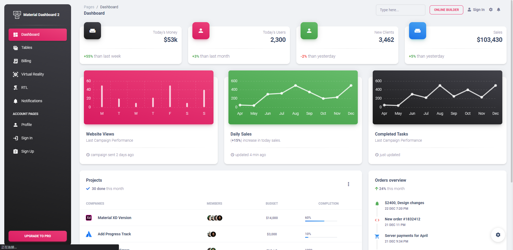
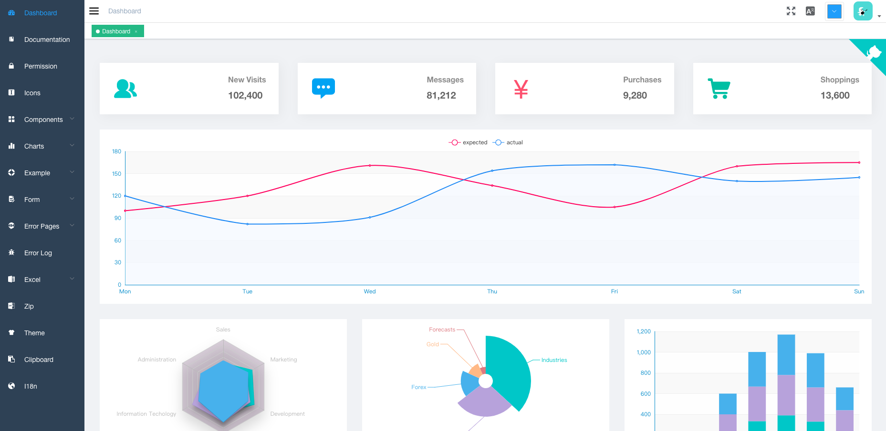
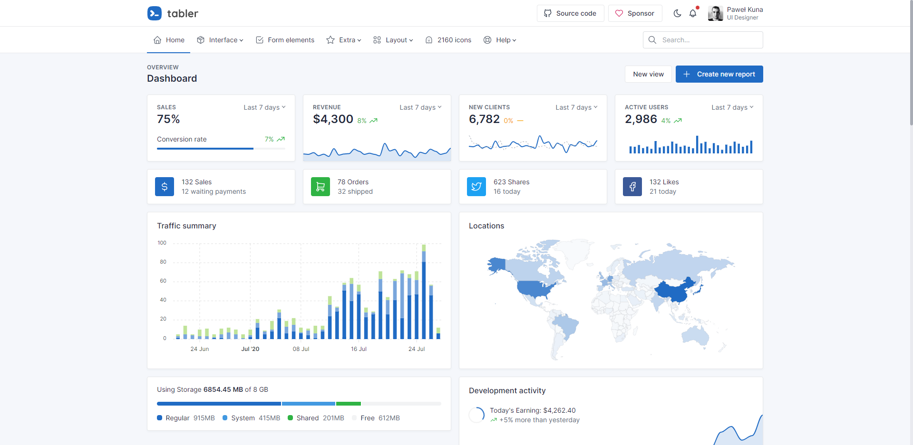
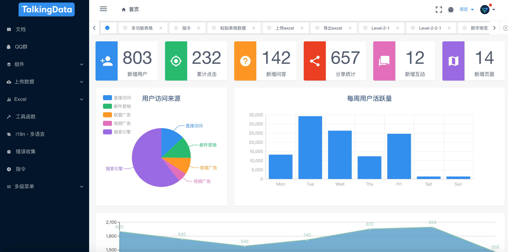
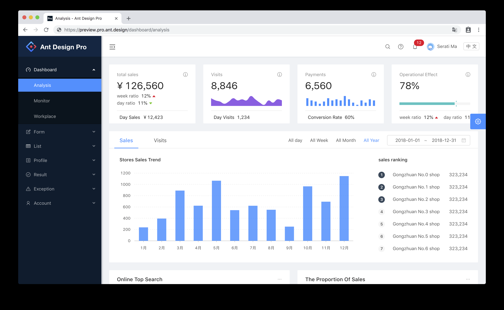
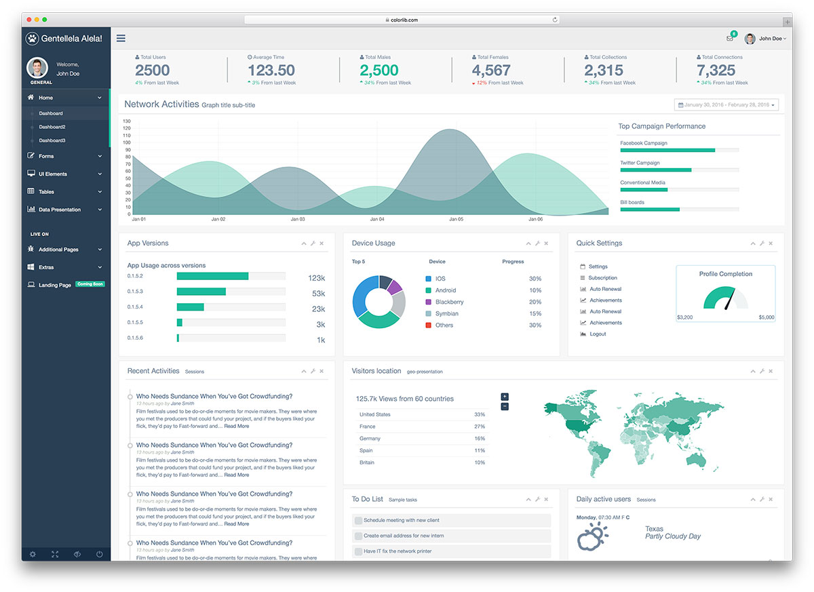

# 后台管理模板
做开发时经常会遇到有“xx后台管理系统”的需求，这里将一些开源免费的后台管理模板记录下来，以后在选型时，可以方便借鉴。

而对于前端开发来说，有这样一套模板，那也是非常省时省力的。

## AdminLTE
AdminLTE 是一个完全响应的管理模板。 基于 Bootstrap 4.6 框架和 JS/jQuery 插件。 高度可定制且易于使用。 适合从小屏到大屏的多种屏幕分辨率。

[GitHub地址](https://github.com/ColorlibHQ/AdminLTE)

[演示地址](https://adminlte.io/themes/v3/)

## Material Dashboard
[GitHub地址](https://github.com/creativetimofficial/material-dashboard)

[演示地址](https://demos.creative-tim.com/material-dashboard/pages/dashboard.html)

## Vue-Element-Admin
vue-element-admin 是一个后台前端解决方案，它基于 vue 和 element-ui实现。它使用了最新的前端技术栈，内置了 i18n 国际化解决方案，动态路由，权限验证，提炼了典型的业务模型，提供了丰富的功能组件。

[GitHub地址](https://github.com/PanJiaChen/vue-element-admin)

[演示地址](https://panjiachen.github.io/vue-element-admin/#/dashboard)

## Tabler
基于Bootstrap4之上的免费HTML控制面板框架。

[GitHub地址](https://github.com/tabler/tabler)

[演示地址](https://preview.tabler.io/)

## iView Admin
基于 iView 的 Vue.js 2.0 admin 管理系统模板。

[GitHub地址](https://github.com/iview/iview-admin)

[演示地址](https://admin.iviewui.com/home/)

## Ant Design Pro
基于 React，一款业开箱即用的企业级应用程序 UI 解决方案。

[GitHub地址](https://github.com/ant-design/ant-design-pro)

[演示地址](http://preview.pro.ant.design)

## Gentelella
使用的 Bootstrap 4 样式以及各种强大的 jQuery 插件和工具开发的一个框架。

[GitHub地址](https://colorlib.com/polygon/gentelella/index.html)

[演示地址](https://colorlib.com/polygon/gentelella/index.html)

## [点击这里](https://wangchujiang.com/awesome-uikit/#admin-template) 查看更多后台管理模板