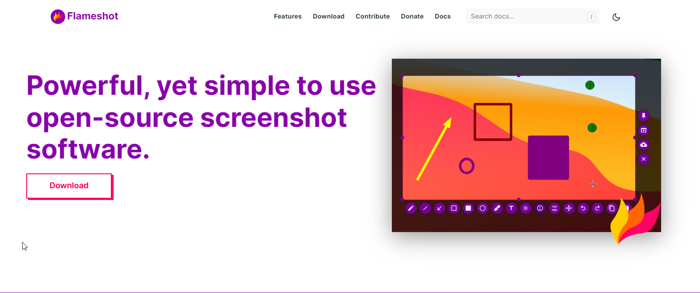
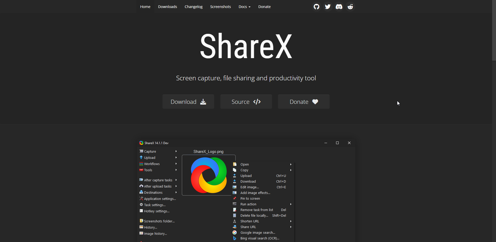
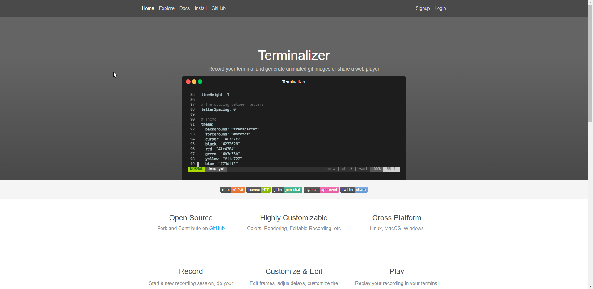
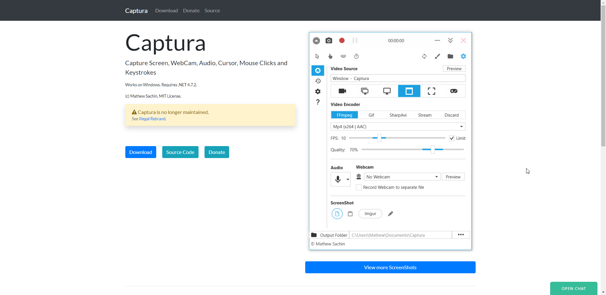
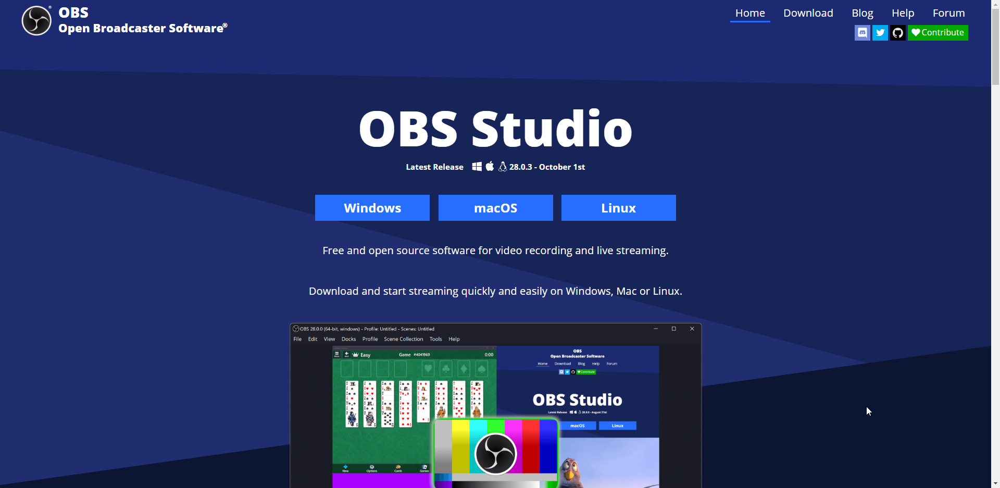

# 好用的开源小工具

## [Flameshot](https://flameshot.org/)
Flameshot能做的不仅仅是截图，截图之后的处理才是其亮点：
  * 敏感信息打码
  * 文本块高亮
  * 自定义区域框选
  * 用图标来标注来引导用户使用

跨平台，免费开源，易上手，详见[项目地址](https://github.com/flameshot-org/flameshot)

## [ShareX](https://getsharex.com/)
一款集截图、屏幕录制、取色、添加水印、gif抓取、图片合成等功能的超实用小工具，界面美观、操作简单、使用零难度。

跨平台，免费开源，易上手，详见[项目地址](https://github.com/ShareX/ShareX)。

## [Terminalizer](https://terminalizer.com/)
充满了极客范的一款小工具，想要让自己充满神秘感、牛逼轰轰的话，用这款工具就对了。

能记录你在 terminal 上的操作并生成动画 gif 图像。

跨平台，免费开源，详见[项目地址](https://github.com/faressoft/terminalizer)

## [Captura](https://mathewsachin.github.io/Captura/)
一款录屏的小工具，声音、鼠标点击、键盘操作都能录下来。项目已经停止维护。

仅支持windows，免费开源，详见[项目地址](https://github.com/MathewSachin/Captura)

## [OBS Studio](https://obsproject.com/)
一款用于视频录制和直播的工具，在电脑上做直播时，可使用该工具。

跨平台，免费开源，详见[项目地址](https://github.com/faressoft/terminalizer)

