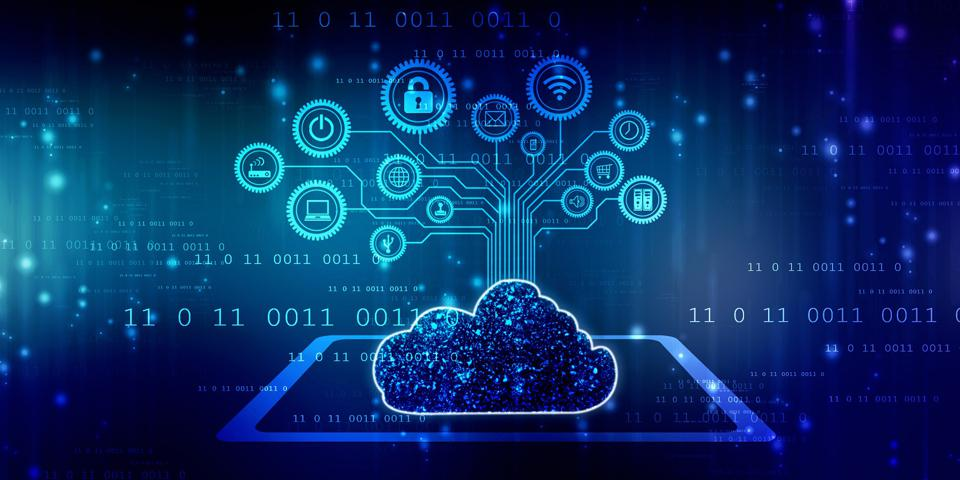

# 云计算
云计算（Cloud Computing）是当前技术领域的热点，它使得用户通过互联网就能方便、快捷地获取高质量的的IT资源和服务，最终用户消费这些IT资源和服务时就像日常生活中的水、点和煤气一样方便。

通常，云计算包含三个层次，由低到高分别是：
  * 基础设施即服务(IaaS)
  * 平台即服务(PaaS)
  * 软件即服务(SaaS)

## IaaS
提供最基本的计算机硬件资源，包括我们熟知的：CPU、内存、硬盘、网络，免去了客户管理硬件基础设置的麻烦。用户能部署和运行任意软件，包括操作系统和应用程序。

例：云服务器

## PaaS
基于IaaS为客户提供软件开发过程中所需要的数据库、中间件等应用。客户不再需要管理该服务的基础设施，包括：CPU、内存、硬盘、网络，但客户能控制其上的应用，包括修改其运行时所需要的配置。

例：云数据库、消息队列

## SaaS
提供给客户的是一个功能完备的应用，跟操作系统软件不同，需要安装才能使用，这种应用拿来即用，通过浏览器就能进行访问。在这一层，客户完全无需关心或控制任何云计算设施。这也是我们现阶段使用最多的服务。

例：百度网盘、有道云笔记、CODING