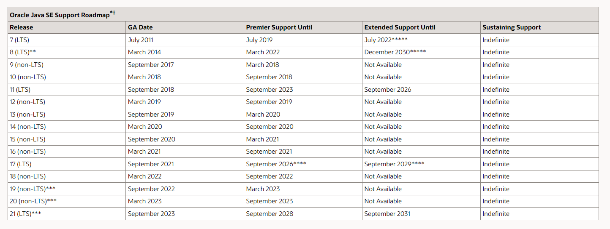
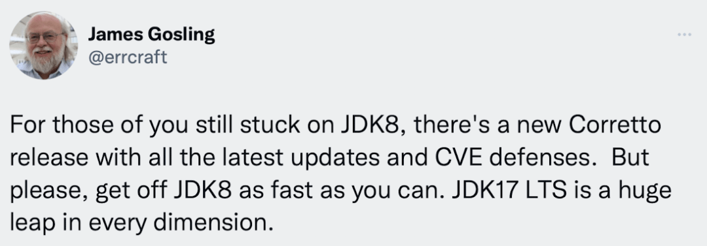
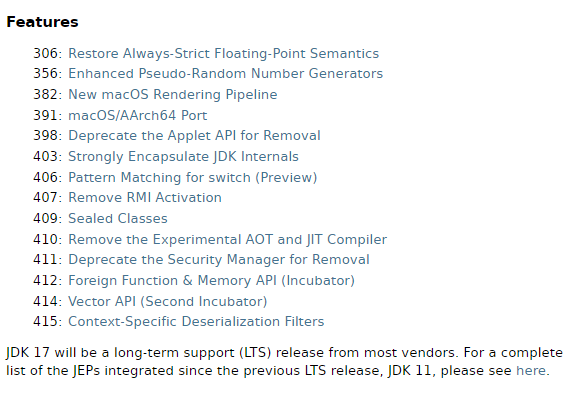

## JDK 到底收不收费
相信很多公司的生产环境用的依旧还是 Oracle JDK 1.8 的版本，但是 JDK 1.8 也有一个免费、收费的分水岭，于是我赶紧检查了一下项目中 JDK 的版本：
```shell
$ java -version
java version "1.8.0_202"
Java(TM) SE Runtime Environment (build 1.8.0_202-b08)
Java HotSpot(TM) 64-Bit Server VM (build 25.202-b08, mixed mode)
```

好家伙，刚好是 JDK 1.8 的最后一个免费版本。JDK 1.8_202 之后，由于 Oracle 修改了协议，所有后续的版本想要商用都要付费了。直到 JDK 17 的出现，这个后面再说。
> 总的来说，想要在商业上免费试用 JDK，版本的选择有两个范围：  
> JDK 1.8_202 之前的版本，或者 JDK 17 之后的版本。  
> 二者其中的版本商用都需要收费，其实选择性也不大，只有一个 LTS 版本，那就是 JDK 11。

为什么很多人不愿意升级到 Java 8 呢？作为企业，追求稳定性永远是第一位的，而且每一次升级，都需要不少的工作量，如果不清楚升级后造成的影响，还会留下很多暗坑，而 Java 8 刚好是旧协议的最后一个版本。Java 8 的 G1 垃圾收集器、lambda 表达式等都是很不错的特性，而且也是 LTS 版本。

2018年，Oracla 修改协议后，也发布了 Java 11 的 LTS 版本，但是要商用需要收费了，这也是很多人不愿意去使用的原因。

如果你是个人，想研究一下新版本的特性、或者做点小工具话，就不需要担心付费问题，Oracle JDK 是完全免费的。

如果你在华为、阿里这种大厂里的话，还有机会见识到自研的 JDK，大厂为了避免协议变更引发的麻烦，都会选择自己基于 OpenJDK 来二次开发，他们也有这个实力。

## 生产环境一定要选择 LTS 版本
根据 Oracle 公布的 [Java SE 支持路线图](https://www.oracle.com/java/technologies/java-se-support-roadmap.html) 显示，从 Java 7 到 Java 21，LTS 版本屈指可数。



不同于 LTS 的 non-LTS 版本（也叫过渡版本），是不适合用在生产环境上的，你想想为什么大家在生产环境上不愿意使用 OpenJDK 的版本，OpenJDK 发布很频繁，语言特性跟 Oracle JDK 完全一样，但是 OpenJDK 版本一旦发布，就不会再维护和更新，所有的功能升级、bug修复都将放到下一个版本上。这与企业追求稳定是背道而驰的，谁也不想一遇到bug就升级一下 JDK。

## 我需要升级到 JDK 17 吗
前面也说了，JDK 17 之后又可以免费商用了，JDK 17 使用了 [NTFC协议](https://blogs.oracle.com/java/post/free-java-license) 而且 JDK 17 又是一个 LTS 长达 8 年的版本，真可谓用心良苦。就连 Java 之父 詹姆斯·高斯林 都来为 JDK 17 打 call 了，可见 JDK 17 真的是有很大看到突破，要不然也得不到大佬的认同。



> 划重点：But please, get off JDK8 as fast as you can. JDK17 LTS is a huge leap in every dimension.

来看看 JDK 17 为我们带来了哪些令人兴奋的特性，内容来自 [OpenJDK JEP](https://openjdk.org/projects/jdk/17/)：

<div align="center">
    
</div>

上面这些语法特性都是代码层面的改动，除此之外，JDK 17 在性能上也有很大的提升，国外有人专门做过性能基准测试，比较了 JDK 11，JDK 16, JDK 17 三款的性能，详情请查看 [性能基准测试比较](https://www.optaplanner.org/blog/2021/09/15/HowMuchFasterIsJava17.html?spm=a2c6h.12873639.article-detail.6.584e6ad8Cab0Zk)。