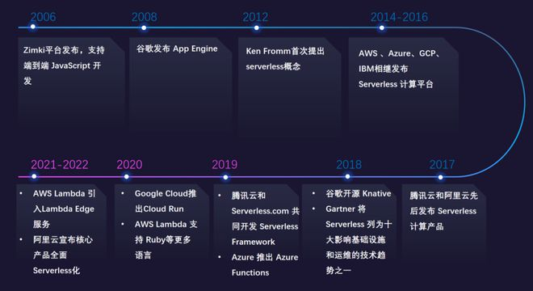

# 架构演变历史
单体架构（MVC形式） + 模块化单体架构 --> SOA --> 微服务架构和云原生

# Serverless

1. 2006 年，伦敦的一家公司发布了名为 Zimki 的平台，该平台提供了端到端的 JavaScript 开发能力，并且最早提出了“Pay as you go”的概念，但在商业上并未取得显著成功。
2. 2008 年，谷歌发布 App Engine 服务，用户的开发方式得到了根本的变革，无须考虑预分配多少资源，也无须考虑操作系统的实现。
3. 2012 年，Ken Fromm 在《软件和应用的未来是 Serverless》中率先提出了 Serverless 的概念。
4. 2014 年，AWS 重磅发布函数计算产品 Lambda，开启了 Serverless 架构的新时代。
5. 2016 年，Azure Function、GCP（Google Cloud Platform）以及 IBM Open Whisk 相继发布 Serverless 计算平台。
6. 2017 年，腾讯云和阿里云先后发布了 Serverless 计算产品——云函数和函数计算；同年，谷歌 GCP 发布了 Firebase 产品，提供多端一体化开发的 Serverless 解决方案。
7. 2018 年，谷歌开源 Knative，尝试将 Serverless 架构标准化。同年，全球知名 IT 咨询调研机构 Gartner 发布报告，将 Serverless 架构列为十大未来将影响基础设施和运维的技术趋势之一。
8. 2019 年，腾讯云和 Serverless.com 达成战略合作，共同开发 Serverless Framework 产品，提供 Serverless 开发的一站式解决方案；Microsoft Azure 也于 2019 年推出了 Azure Functions。
9. 2020 年，Google Cloud 推出 Cloud Run 服务，AWS Lambda 支持 Ruby 等更多语言。
10. 2021 年，AWS Lambda 引入新的 Lambda Edge 服务，它可以将内容置于全球 CDN 网络上，从而提供快速和可靠的服务
11. 2022 年，阿里云宣布核心产品全面 Serverless 化。

# 参考
1. [备受云厂商们推崇的 Serverless，现在究竟发展到什么水平了？](https://www.163.com/dy/article/I02197N00511D3QS.html)
2. [什么是serverless](https://blog.csdn.net/weixin_43705953/article/details/121288522)
3. [Appsmith 为何放弃微服务选项，选择模块化单体架构？](https://www.infoq.cn/article/HwGH96PJXowBSKYLV3at)