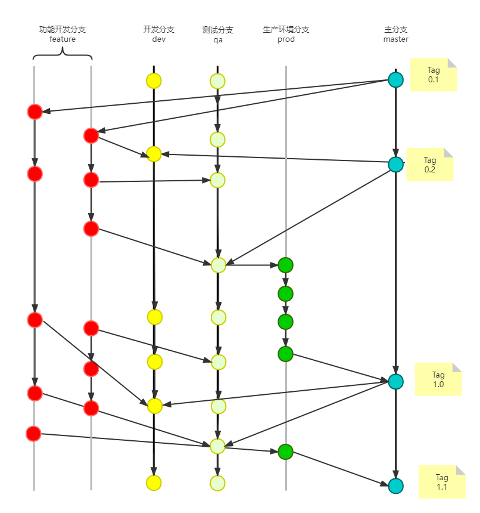

# Git分支模型
Git灵活的分支管理是其一大特色，没有绝对的好与坏，只有适合与不适合。像我这个知识库管理，就只有我一个人在上面写内容，一个分支就足够了，分支太多反而变得麻烦。

我的经验是：根据团队的大小、环境的类型（测试环境、准生产环境、生产环境、Alpha环境等）来决定所采用的分支模型。

来看一下复杂情况下的分支模型`git-flow`，当前复杂情况下的分支模型都由该模型演变而来。感兴趣的可以去看原文 [A successful Git branching model](https://nvie.com/posts/a-successful-git-branching-model/)

这个模型有两个不恰当的地方：
1. 把 develop 分支作为主要分支模型，新功能开发完成后，需要将分支的代码都要先往 develop 分支合并，然后再合并到 release、master 分支。如果有多个功能同时开发，但是上线时间不一样（在项目中很常见）。由于代码需要测试，就都合并到了 develop 分支，意味着 develop 一个功能上线时，会把其他功能的代码也带上去。

2. 问题1的由来是因为没有考虑到多个环境的问题，项目中经常会有多个环境的需要，比如：供开发人员自测功能的测试环境、供测试人员验证 BUG 的 QA环境、供客户验收功能的 UAT环境、线上的生产环境，每一个环境都需要一个独立的分支，互不干扰。

为了适应多个迭代并行开发、多套环境，项目中采用了如下分支模型：

**master分支**: 所有的其它分支的代码都从 master 分支拉取。每一个功能、BUG上线后，代码都需要合并到 master 分支。

**develop分支**: 开发分支，供开发人员使用，自测、冒烟测试所在地，允许多个功能分支的代码合并进来，该分支是独立的，不会往其它分支合并。

**qa分支**：测试分支，供测试人员使用，功能分支的代码在测试环境测过后，将合并到这个分支。**该分支仅允许同一批次上线的代码进行合并**。

**prod分支**：生产环境分支，代码由qa分支合并而来，理论上是跟qa分支高度一致的，**需要时刻维持该分支的稳定性，仅qa分支的代码达到上线标准后才能合并到该分支**。

# 参考
1. [Comparing Workflows](https://www.atlassian.com/git/tutorials/comparing-workflows)
2. [A successful Git branching model](https://nvie.com/posts/a-successful-git-branching-model/)