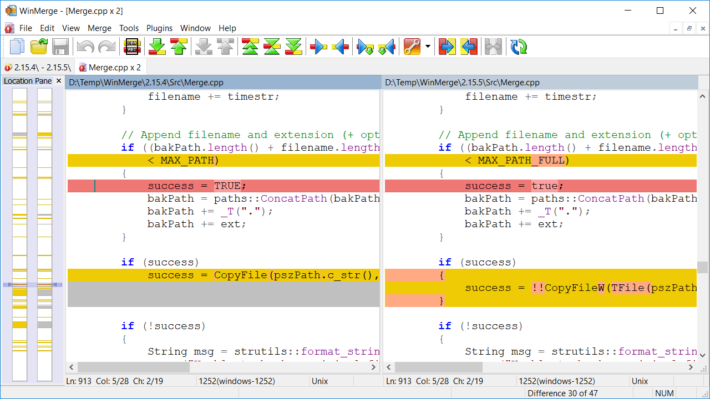
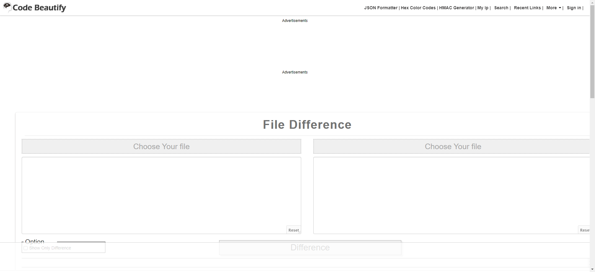

刚接手了一个项目，项目有9个品牌的客户，对应了9个代码仓库，每个代码仓库的逻辑大体一样，只有其中部分逻辑是定制的，这时就很需要一个代码比对工具来查看文件了。

# [WinMerge](https://winmerge.org/)
WinMerge是一个开源的Windows区分和合并工具。WinMerge可以比较文件夹和文件，以易于理解和处理的可视化文本格式显示差异。

# [Code Beautify](https://codebeautify.org/file-diff)
在线文件比对工具，如果不想安装软件，可以考虑使用该工具。
